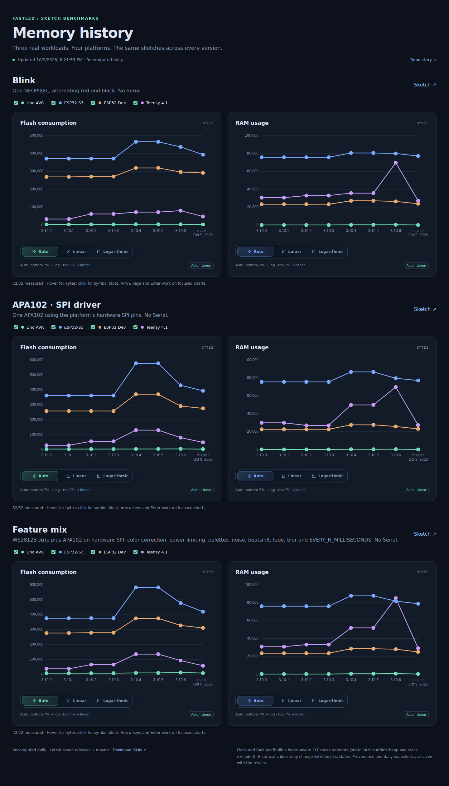

# FastLED memory dashboard

## [Open the interactive dashboard →](https://fastled.github.io/dashboard/)

[](https://fastled.github.io/dashboard/)

The image is a noninteractive screenshot of the actual Chart.js overview. Click
it for the full interactive site: hover points for bytes and click them to open
the selected Flash or RAM symbol report for that platform/version. Reports show
the top 10 symbols, then append 50 more per click while keeping earlier rows. [Site preview image](docs/assets/preview.png)
is also generated from the actual dashboard for social link previews.

Hover, focus, or click a symbol to inspect who references it (one level).
Symbol-level and object-file references are listed separately. Unavailable
analysis and unexplained retention are explicit; empty lists do not imply
unused code. See the [reference audit](REFERENCE-AUDIT.md) and
[coordinated follow-ups](https://github.com/FastLED/dashboard/issues/18).

[Benchmark policy and decisions](POLICY.md)

Three sections: **Blink**, **APA102 hardware SPI**, and **Rainbow animation**
(16 LEDs, a 48-byte LED buffer on Uno). Each has flash consumption on the left and static
RAM usage on the right. Four series: Uno AVR, ESP32-S3, ESP32 Dev, Teensy4.1.
Each chart has its own **Auto / Linear / Logarithmic** selector. Auto starts linear;
move into the bottom 7% of a plot to reveal small targets with logarithmic scaling,
or into the top 7% to return to linear. The middle retains the current scale.
Select Linear or Logarithmic to pin that chart's scale.
Latest seven stable releases plus the latest master SHA; initially 3.10.0–3.10.6.

## Benchmark protocol

Every version builds the exact committed sketches, without Serial calls.
`benchmark/SPI.ino` uses APA102 on hardware SPI; `benchmark/Rainbow.ino`
animates an HSV gradient. `benchmark/Blink.ino` uses one NEOPIXEL
on GPIO 3, red/black with 1000 ms delays, **no Serial initialization or prints**.
Released library source is extracted unmodified with `git archive`; the same
Arduino entry-point stub uses `::delay(0)` across revisions. This is a matched
Blink workload, not each release's potentially different example sketch.

Daily runs install the latest stable fbuild (currently 2.5.37) and recompute all
seven release profiles plus master; historical values can change with tooling. Committed per-board configurations are shared across
all releases. ESP32 boards use Arduino-ESP32 3.3.11/IDF 5.5.5. Uno uses Arduino
AVR core 5.4.0/AVR GCC 7.3.0. Teensy uses framework 1.160.0/ARM GCC 11.3.1 with
the normal fbuild Teensy board defaults. Resolved compiler paths, defines,
flags, exact source SHA, sketch/config protocol hash and ELF hash accompany
each measurement; a toolchain/config change requires a separately identified
protocol and historical remeasurement rather than silently mixing results.

Flash and RAM are fbuild's exact board-aware ELF byte totals, excluding linker
reservations (GNU size incorrectly counts ESP32 dummy sections as RAM).
RAM excludes runtime heap/stack. Additional bloat metrics (`image_flash`,
`attributed_ram`) are preserved separately and do not replace physical totals.
The board-aware build summary is required; rounded KB displays are rejected.
The sketch contains no Serial calls. Serial linkage introduced by a library
version is recorded and included in its footprint, rather than changing that
release's source or logging flags to hide it. A failed build produces a gap
and an error, never zero.

The daily workflow runs at 09:23 UTC. It pins master once per run, measures all 96
sketch/board/version combinations sequentially, regenerates the README screenshot, commits full point-specific bloat reports,
`docs/data/latest.json` and
UTC daily snapshots in `docs/data/history/`, and deploys `docs/` to GitHub Pages.
Build logs, metadata and symbol reports are uploaded as workflow artifacts.
Immutable revision/config-specific projects and global SDK caches are reused.
This dedicated benchmark workflow does not invoke FastLED CI Full.

## Run locally

Site-only pushes publish existing data directly, skipping benchmark builds,
toolchain setup and screenshot-browser installation. Daily measurement runs
refresh the data and screenshot. When changing the chart overview, regenerate
its screenshot locally with `npm run screenshot`.

Collection and publishing run in separate jobs and concurrency groups. The
view reads committed JSON artifacts; a long collection run does not block
publishing a new layout or interaction using the existing measurements.

```sh
npm ci
npm run check             # strict TypeScript, ESLint, formatting and schema tests
npm run build             # browser bundle and versioned JSON Schema artifacts
uv sync --upgrade-package fbuild  # external firmware tool only
npm run benchmark
# Refresh references from matching saved ELFs, without firmware builds:
node scripts/refresh-references.ts
node scripts/audit-references.ts
# A focused run, using an existing FastLED clone without modifying its checkout:
npm run benchmark -- --source /path/to/FastLED --boards uno --versions 3.10.3 master
npx playwright install chromium
npm run test:view
npm run screenshot
npm run dev
```

No git worktrees are created. Git archives read revisions without switching
the FastLED checkout. SDK downloads, build outputs and logs live in `.cache/`.
Historical snapshots retain daily master history; the main charts show the
release progression ending with the latest master datapoint. Source SHAs are recorded in each point’s report metadata.

The application and collection scripts are TypeScript on Node.js 24+. fbuild
remains an external tool installed through uv; no Python dashboard scripts remain.
Transport is validated eagerly with strict shared schemas and inferred TypeScript
models, with published JSON Schema files in `docs/schemas/`. The browser view is
generated from `src/`; edit those files, then run `npm run build` before committing.
